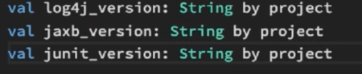
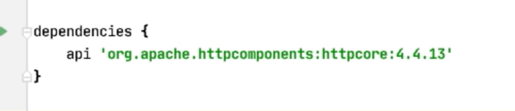
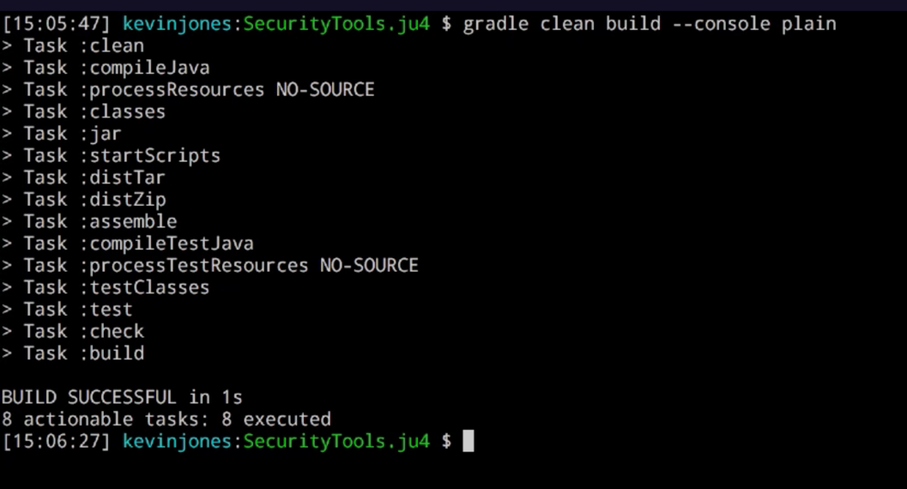
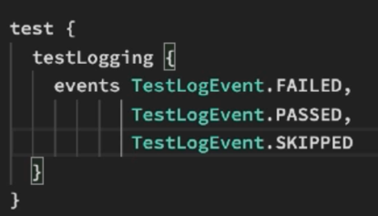
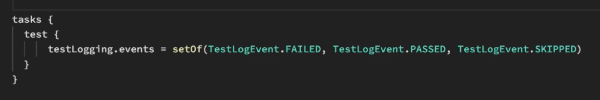
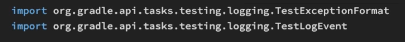
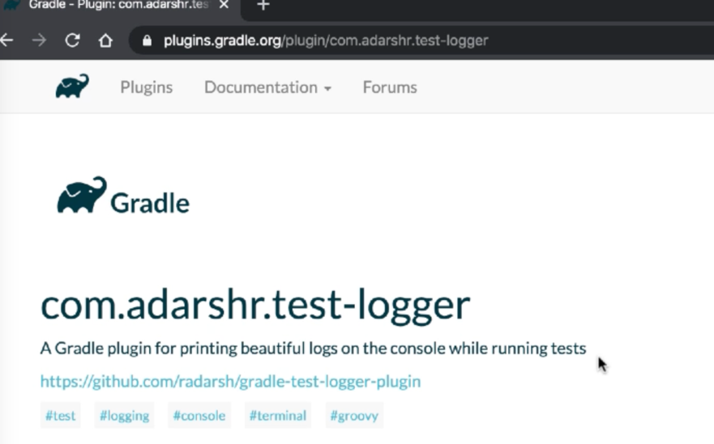
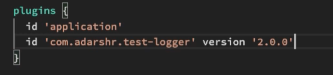
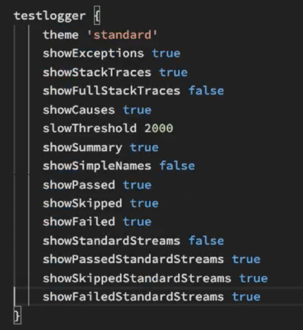
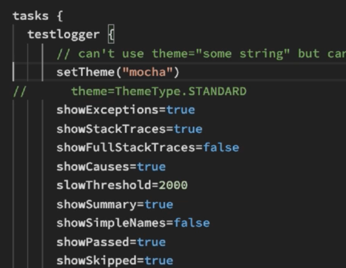

Gradle Notes
=============


[Pluralsight Course](https://app.pluralsight.com/course-player?courseId=a61c8be3-b536-44cd-b900-fe33b9c9405e)

The course is using Gradle 7.2 and says right up front it is not applicable to 8 which is what most people are using :-(

Gradle like maven is conventions based, but it's highly configurable

It uses a DSL (domain specific language) rather than xml

Builds many languages, java, kotlin, c++, etc

Supports dependency management

## Build scripts

The first thing you create is a build script which can be done in kotlin or goovy

### Tasks

The build script defines task: build, clean, etc...

Tasks can have a doFirst and a doLast defined

### Plugins

plugins are a way of extending gradle and adding tasks

for example `apply plugin: 'java'` will add many tasks

by convention it will look for files inside source/main

`apply plugin: 'java'` has been superceded by

```
plugins {
  id 'java'
}

```

### Gradle Wrapper

notice when you run gradle tasks, there's a task called wrapper, if you run gradle wrapper it will create all the gradlew stuff which means that someone running your project doesn't need to install gradle globally 

### Projects

A build may have more than one projects and project may have many tasks

A project has a build file

Optionally you can have a **Settings File**: It can hold information that the build file might need, like version numbers

A Build file defines tasks for the project as described earlier

Gradle has some built in tasks like wrapper, tasks

You can add more tasks directly or indirectly via plugina

When running a task there are 3 build phases

1. Initilization: gradle works out which projects will be part of the build
2. Configuration: projects are configured by running all build scripts for all projects
3. Execution: gradle works out which tasks to execute based on task name passed

Each task has

1. doFirst
2. doLast
3. there's also a conditional we'll come back to

Tasks can have dependencies as can sub tasks


## Building kotlin and Java projects

There are 3 java plugins we can use

1. plugins `{ java }`
2. plugins `{ java-library }` extends the java plugin
3. plugins `{ application }` extends the java plugin, applies another plugin called the distribution plugin

standard code layout has a src directory with main and test under it

src ->
   main -> java, kotlin, resources
   test -> java, kotlin, resources

This is just like maven. If for some reason you need to change this, you can do it using `sourceSets`

**Example sourcSets (Groovy)**
```
sourceSets {
	main {
		java {
			srcDir 'src/java'
		}
		resources {
			srdDir 'src/resources'
		} 
	}	
}
```


### Library vs Application

instead of the java plugin I can 'application' which extends java

plugins can add properties for you to set, in this case there is mainClassName

with the plugin set to 'application'

I can specify

`mainClassName = 'com.sonatype.pluralsight.Main'`

in kotlin I would need to do: 

```
application {
	maindClassName = "com.sonatype.pluralsight.Main"
}
```

then do `gradle run` to execute it 


### Java plugin

I can add a java block and change settings like information about the build,
for example sourceComaptability, and targetCompatability

### Create gradle wrapper at specific version

gradle wrapper --gradle-version=7.2

## Dependencies

Project may depend on other projects, external libraries or internal libraries

You can have dependencies for: Compilation, runtime, test compilation, and test runtime

Some dependencies will be transitive

### Listing dependencies

gradle -q dependencies
gradle -1 dependencies --configuration implementation


### Configuration Scopes

* implementation: main part of our project, used at both compile and runtime, you can mark it as only one of these
* testImplementation: some as above, by default used for both compile and test but you can specify, testCompileOnly
  for example

### Using a Properties file

The `by` in this line is example of a kotlin `delegate`

`val log4j_version: String by project`




### api vs implementation

Specifying api means that in addition to including in this project/sub-project we'll re-expose this
as a dependency for projects that depend on this so that they don't also have to supply the dependency



### A good way to get more info about the tasks that are running

`./gradlew clean build --console plain`



### To see test logs



or for kotlin



keep in mind there's an import you need to add



there's a test-logger plugin we can add which lets us to much better







^ many of these values are defaults and are just shown for example purposes

kotlin version:



### Running a single test

`gradle test --tests *shouldCreateASession`
